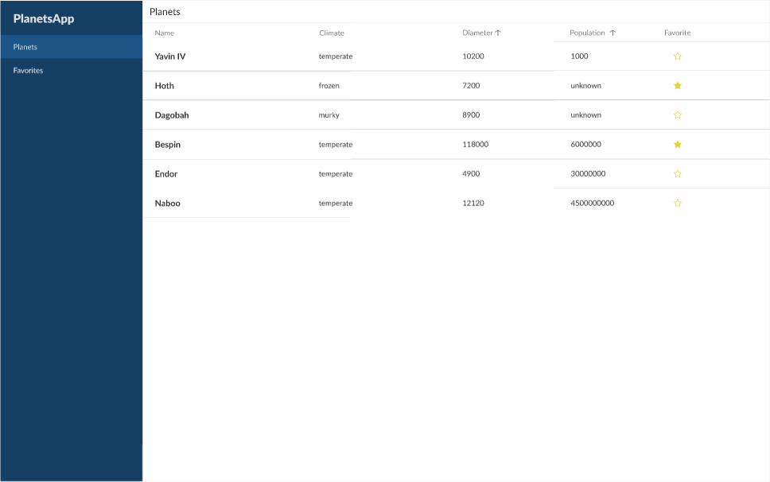

# Star Wars Expedition 🪐

Welcome to the Star Wars Expedition project! 🚀

## Description

This repository explores techniques for developing a data management system using the [Star Wars API](https://swapi.dev/). The application is built using TypeScript, Next.js (leveraging app routes), and Styled Components.

To ensure a consistent and visually appealing user interface, the project design aligns with the proposal available on [Figma](https://www.figma.com/file/LUmB3DVIrCS5zVME8zfeQu/Front-technical-challenge?type=design&node-id=1-8)



## Demonstration 🎬

/// gif demo

## Instructions 📑

To run the app, follow these steps:

- First, clone the repository

```
git clone git@github.com:ninamarq/star-wars-test-expedition.git
```

- After clonning the project, open it on VSCode or another code editor. Then, open the project and get into client-app for running it

```
cd star-wars-client-app
```

- Install dependencies

```
npm install
```

- Run the project

```
npm run dev
```

- Now, access the link on you terminal, or just try accessing `http://localhost:3000`

### Thank you for being here!

## Created by me [@ninamarq](https://www.github.com/ninamarq) 🚀✨
