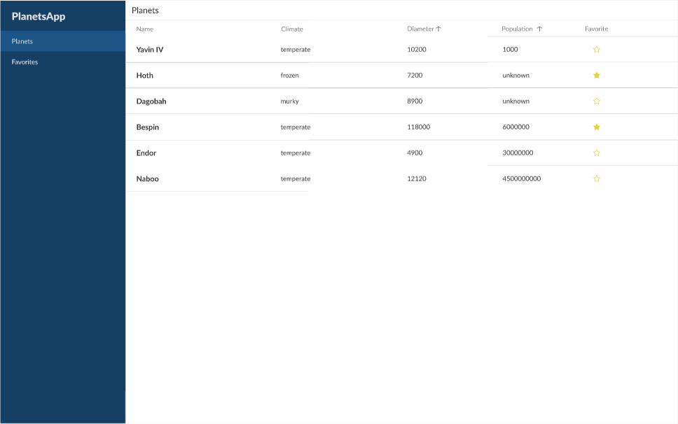
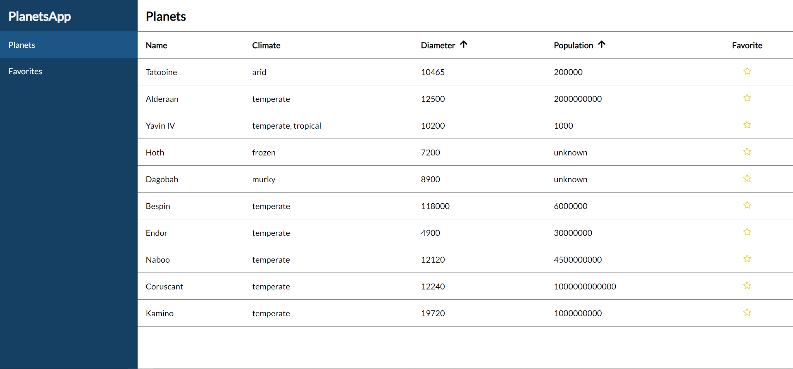
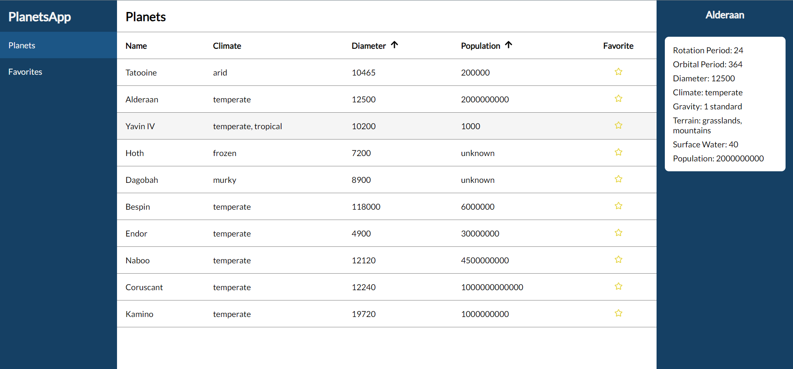
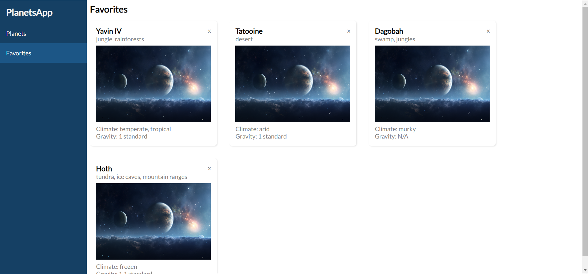
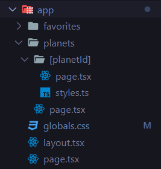
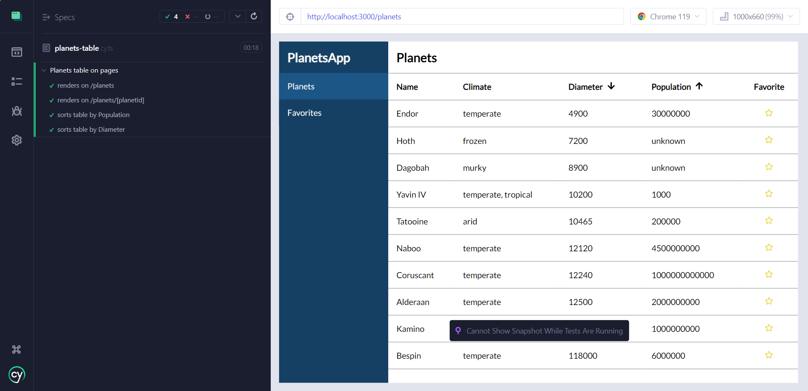

# Star Wars Expedition 🪐

Welcome to the Star Wars Expedition project! 🚀

## Description ✏️

This repository explores techniques for developing a data management system using the [Star Wars API](https://swapi.dev/). The application is built using TypeScript, Next.js (leveraging app routes), and Styled Components.

To ensure a consistent and visually appealing user interface, the project design aligns with the proposal available on [Figma](https://www.figma.com/file/LUmB3DVIrCS5zVME8zfeQu/Front-technical-challenge?type=design&node-id=1-8)



## Demonstration 🎬

Here we have the results obtained by page.

`/planets`



`/planets/[planetId]`



`/favorites`



## Development and technologies 🧠

For this project, the technologies used were:

- [React icons](https://react-icons.github.io/react-icons/)
  - This library was used with the only purpose to get the best SVGs for the projec
- [React query (Tanstack query)](https://tanstack.com/query/v3/):
  - React query was employed to cache the Star Wars API results, optimizing performance by preventing unnecessary rerenders or refetching, ensuring clean asynchronous data management.
- [Next.js](https://nextjs.org/)

  - Next.js was chosen for its superior route performance, utilizing the [App route](https://nextjs.org/docs/app/building-your-application/routing) architecture. The directory structure inside /app represents each page/route in the project, providing efficient page routing, pushing, and parameter management.

  

- [Styled Components](https://styled-components.com/)
- [Cypress](https://nextjs.org/docs/pages/building-your-application/optimizing/testing)
  -Cypress is a robust test runner that serves dual purposes for End-to-End (E2E) and Component Testing within the Next.js framework. Its selection stemmed from its seamless integration with Next.js, offering straightforward setup procedures and facilitating the writing and execution of tests. Also, it was a good opportunity to study it.
  

## What would I do different? 🤔

- Testing with Cypress
  - Implementing comprehensive testing covering at least 80% of the project files and functionalities would ensure a safer user experience with Cypress. It is a great test runner to scale the project.
- Zustand or Valtio
  - Considering the utilization of either Zustand or Valtio for better state and data management to enhance scalability and performance. These libraries would facilitate secure and efficient development of PlanetsApp, benefiting both users and developers in terms of data control and faster feature design or maintenance.
- Responsiveness with MaterialUI displays
  - For this, didn't have time to make the project responsive, probably this would be my priority after testing the app.

## Instructions 📑

To run the app, follow these steps:

- First, clone the repository

```
git clone git@github.com:ninamarq/star-wars-test-expedition.git
```

- After clonning the project, open it on VSCode or another code editor. Then, open the project and get into client-app for running it

```
cd planets-app
```

- Install dependencies

```
npm install
```

- Run the project

```
npm run dev
```

- Now, access the link on you terminal, or just try accessing `http://localhost:3000`. If you want to watch Cypress testing, please run

```
npm run cypress:open
```

That's it

### Thank you for being here!

## Created by me [@ninamarq](https://www.github.com/ninamarq) 🚀✨
